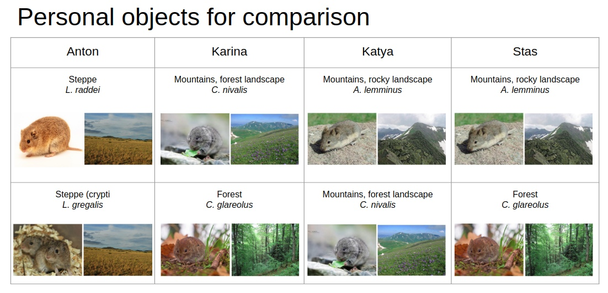

# Project-1-semester-IB
Authors: 

- Danko Katerina 
- Anton Sidorin
- Sogomonyan Karina
- Ilyutkin Stanislav

### Introduction 
Habitat adaptation is one of the key factors in evolutionary success and species radiation. Voles inhabit different biotopes worldwide. Close relatives with a little differences in genome live in forests and in rocky mountains. Moreover cryptic species live in the same еcological niches, but differ genetically. Vole adaptation to different habitats occurs due to changes in gene expression. However, the differentially expressed genes were still not fully understood for voles from different habitats and cryptic species from the same habitat. 
We performed differential expression analysis for close relative species, inhabiting forests (*C. glareolus*), forest mountains (*C. nivalis*), rocky mountains (*A. lemminus*) and two cryptic species *L. raddei* & *L. gregalis* from steppe.

**Goal**
To carry out a comparative analysis of the differential expression of the vole representatives living in different niches

**Tasks**
1. Estimate the quality of raw reads
2. Align reads on the reference genome of Microtus ochrogaster
3. Find differentially expressed genes
4. Carry out the gene ontology analysis

### Data
For all species, except for *C.glareolus*, tissues of the following organs were sequenced: muscle, heart, lungs, testes, and brain. *C. glareolus* tissues were not sequenced by us, but taken from the NCBI database. Paired reads of the heart, liver and spleen were found for this species.

