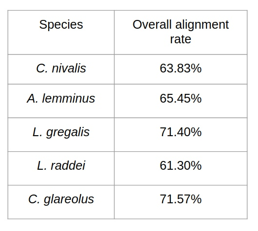
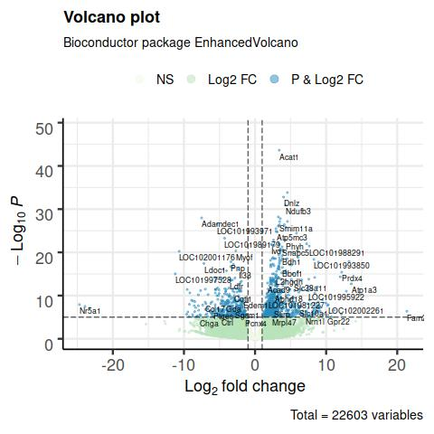

# Project-1-semester-IB
Authors: 

- Danko Katerina 
- Anton Sidorin
- Sogomonyan Karina
- Ilyutkin Stanislav

### Introduction 
Habitat adaptation is one of the key factors in evolutionary success and species radiation. Voles inhabit different biotopes worldwide. Close relatives with a little differences in genome live in forests and in rocky mountains. Moreover cryptic species live in the same еcological niches, but differ genetically. Vole adaptation to different habitats occurs due to changes in gene expression. However, the differentially expressed genes were still not fully understood for voles from different habitats and cryptic species from the same habitat. 
We performed differential expression analysis for close relative species, inhabiting forests (*C. glareolus*), forest mountains (*C. nivalis*), rocky mountains (*A. lemminus*) and two cryptic species *L. raddei* & *L. gregalis* from steppe.

**Goal**
To carry out a comparative analysis of the differential expression of the vole representatives living in different niches

**Tasks**
1. Estimate the quality of raw reads
2. Align reads on the reference genome of Microtus ochrogaster
3. Find differentially expressed genes
4. Carry out the gene ontology analysis

### Data
For all species, except for *C.glareolus*, tissues of the following organs were sequenced: muscle, heart, lungs, testes, and brain. *C. glareolus* tissues were not sequenced by us, but taken from the NCBI database. Paired reads of the heart, liver and spleen were found for this species.


### Quality control
First of all, we checked the quality of our reads using FastQC (https://www.bioinformatics.babraham.ac.uk/projects/fastqc/). We used the MultiQC tool (https://multiqc.info/) for a more visual presentation of the quality control data (see attached materials) . According to the preliminary assessment of the reads, it can be argued that the data is of good quality.  However, at the beginning of the reads, an uneven distribution of ~ 15 bases. This may indicate the presence of adapters, as well as simply the poor quality of the reads at the beginning of the sequences. We also got rid of very short reads (less than 30 in length), and those with several nucleotides in a row are of low quality.  Samples were trimmed by Trimmomatic-0.39 (http://bitinfo.colorado.edu/biofrontiers-core-facility-workshops/previous-biofrontiers-workshops/short-read-2015/day-4/trimmomatic-manual) For adapter removing we additionally used AdapterRemoval (v. 2.3.1)

Example of command for trimming:
```
java -jar Trimmomatic-0.39/trimmomatic-0.39.jar  PE -phred33 5441_S37_R1_001.fastq.gz  5441_S37_R2_001.fastq.gz C_nivalis_pairs_1-2.fastq.gz  C_nivalis_single_1-2.fastq.gz C_nivalis_pairs_2-2.fastq.gz  C_nivalis_single_2-2.fastq.gz HEADCROP:10  SLIDINGWINDOW:4:15 MINLEN:30
```
New trimmed files were checked with FastQC again  (see attached materials) . As a result, we got rid of low quality nucleotides at the beginning of the reads, adapters, short reads and low quality reads.

### Alignment
We decided to align reads to the genome of well characterised species - Microtus ochrogaster, which is the closest relative to our experimental species and has the most fully assembled genome and its annotation.
Reference genome - M.ochragaster
- GCF_000317375.1_MicOch1.0_genomic.fna.gz (genome, fasta format)
- GCF_000317375.1_MicOch1.0_genomic.gff.gz (genome annotation, GFF format)

We mapped our reads via HISAT2 programm. In order to start the alignment, indexes of the reference genome must be built:
```
hisat2-build /path/to/reference_genome.fna genome_index
```
For species closer to the reference (C.nivalis), we used the command:
```
hisat2 -p 2 -x genome_index -1 <forward reads> -2  <reverse_reads>| samtools view -b > aligned.bam
```
For more distant (C. glareolus, L. gregalis A ,  L. raddei, A.lemminus ) we used more soft parameters , as the overall alignment with standard parameters rate was low:
```
hisat2 --mp 2,1 --sp 1,1 -p 2  -x genome_index -1 <forward reads> -2  <reverse_reads>| samtools view -b > aligned.bam
```
Results of alignment:



### Quantifying with featureCounts
FeatureCounts only accepts gtf as input, but gff cannot. Therefore, first we convert the gff file to gtf using gffread.
```
gffread GCF_000317375.1_MicOch1.0_genomic.gff -T -o GCF_000317375.1_MicOch1.0_genomic.gtf
```
Command for featureCounts:
```
featureCounts -p -g gene_id -a GCF_000317375.1_MicOch1.0_genomic.gtf -o output_name.featureCounts.txt *.bam
```
We used the MultiQC tool to visualize the results of featurecounts:


See the results for other comparisons in the repository

### DESeq2 and GO analysis in R

Packages which were used in analysis.
```
library(DESeq2)
library(dplyr)
library(RColorBrewer)
library(gplots)
library(EnhancedVolcano)
library(DT)
library(clusterProfiler)
library(enrichplot)
library(ggplot2)
```

### DESeq2
**1. Data pre-processing.**

Read the file with featureCounts results.
```
countdata <- read.table("feature_counts.txt", header=TRUE, row.names=1)
```

Pre-processing of dataset for DESeq2 analysis.
```
# Remove first five columns (chromosome, start, end, strand, length)
countdata <- countdata[ ,6:ncol(countdata)]

# Rename columns according to your samples (e.x. we had several vole species)
colnames(countdata) <- c("Species_A1", "Species_A2", "Species_B1","Species_B2")

# Convert to matrix
countdata <- as.matrix(countdata)
```

**2. Condition assignment.**

DESeq needs a condition, which includes "control" and "experiment". You may assign whichever sample type as control (e.x. we assigned `Species_A` as control), and the rest one as experiment (e.x. we assigned `Species_B` as experiment). So that DESeq2 compares gene expression of "experiment vs control" model.
In the present dataset we had 2 biological replicates of `Species_A` and `Species_B` , so that we created the following condition:
```
(condition <- factor(c(rep("ctl", 2), rep("exp", 2))))
(coldata <- data.frame(row.names = colnames(countdata), condition))
dds <- DESeqDataSetFromMatrix(countData = countdata, colData = coldata, design = ~ condition)
```

**3. Running DESeq2.**

The following commands generate new dataset
```
# Run DESeq2
dds <- DESeq(dds)
# Format the results
res <- results(dds)
head(res)
```
**4. Volcano plot.**

Now it is time to visualization. One of the best way to visualize differential gene expression is Volcano plot.
```
EnhancedVolcano(res,
                lab = rownames(res),
                x = 'log2FoldChange',
                y = 'pvalue',
                pCutoff = 10e-12,
                xlab = 'Species B')
```


Results may be sorted and saved.
```
# Sort the results data frame by the padj and foldChange columns.
sorted <- res[with(res, order(padj, -log2FoldChange)), ]
head(sorted)
# Turn it into a dataframe to have proper column names.
sorted.df <- data.frame("id"=rownames(sorted),sorted)
# Write the table out.
write.table(sorted.df, file="results.txt", sep="\t", col.names=NA, quote=FALSE)
```


**5. Data normalization and heatmap plot.**

Another way to visualize differential gene expression is a heatmap. 
Firstly, data must be normalized.

```
# Get normalized counts
nc <- counts(dds,normalized=TRUE)

# Turn it into a dataframe to have proper column names.
data <- data.frame("id"=rownames(nc),nc)
gene <- data[,1]
vals <- as.matrix(data[,2:ncol(data)])

# Adds a little noise to each element to avoid the clusting function failing on zero variance datalines.
vals = jitter(vals, factor = 1, amount=0.00001)

# Calculate zscore
score = NULL
for (i in 1:nrow(vals)) {
  row = vals[i,]
  zscore = (row-mean(row))/sd(row)
  score = rbind(score,zscore)
}
row.names(score) <- gene
zscore <- score

# Generate heatmap
mat <- as.matrix(zscore)
```

Draw a heatmap. Note that if you have big data it may takes up to 20 minutes (depends on your computer and data size).

```
pdf('heatmap.pdf')
colors <- colorRampPalette(c("green", "black", "red"),space = "rgb")(256)
heatmap.2(mat, col = pal, density.info = "none",trace = "none", margins = c(14,14), lhei = c(1,5))
invisible(dev.off())
```


### GO analysis

GO analysis allows to group differentially expressed genes by their molecular function, biological process or cellular component.

**1. Annotation downloading.**

Firstly, reference genome annotation must be downloaded from http://bioconductor.org/packages/release/BiocViews.html#___OrgDb .

We investigated the differential gene expression in voles, so we have decided to choose Rat annotation as it is the closest relative to vole among all organisms presented in abovementioned database.
```
organism = "org.Rn.eg.db"
BiocManager::install(organism, character.only = TRUE)
library(organism, character.only = TRUE)
```
**2. Gene key type checking.**

On the next step gene key type must be checked. It is very important step as clusterProfiler cannot recognize gene key type automatically. Therefore right gene key type must be denoted manually.
Here is an example of gene key type conversion from SYMBOL to ENSEMBL.
```
df <- sorted.df

# Convert gene key type
gene_list <- as.character(df$id)
gene_ensemble <- select(org.Rn.eg.db,
       keys = gene_list,
       columns = c('ENSEMBL'),
       keytype = 'SYMBOL')
gene_ensemble_uniq <- distinct(gene_ensemble, SYMBOL, .keep_all = TRUE) 
df_n <- cbind(df, gene_ensemble_uniq)
```
**3. Data preparation for GO analysis.**
```
# Log2 fold change is needed
original_gene_list <- df$log2FoldChange

# Name the vector
names(original_gene_list) <- df_n$gene

# Omit any NA values 
gene_list <- na.omit(original_gene_list)

# Sort the list in decreasing order (required for clusterProfiler)
gene_list = sort(gene_list, decreasing = TRUE)

# View the acceptible key gene types
keytypes(org.Rn.eg.db)
```

**4. Running GO**
```
gse <- gseGO(geneList=gene_list, 
             ont ="BP", 
             keyType = "ENSEMBL", 
             nPerm = 10000, 
             minGSSize = 3, 
             maxGSSize = 1000,
             pvalueCutoff = 0.001,
             verbose = TRUE, 
             OrgDb = organism, 
             pAdjustMethod = "none")
dotplot(gse, showCategory=10, split=".sign") + facet_grid(.~.sign)
```

